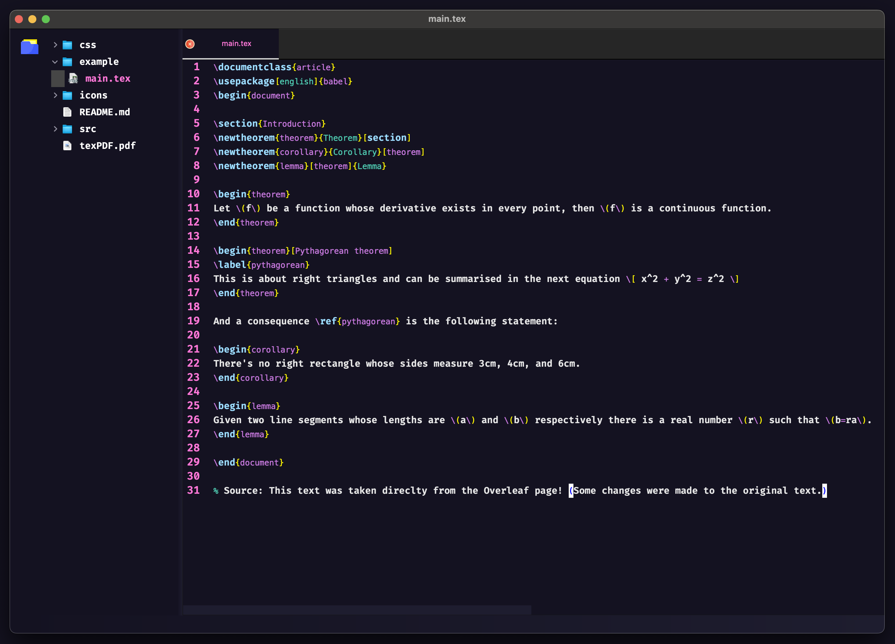
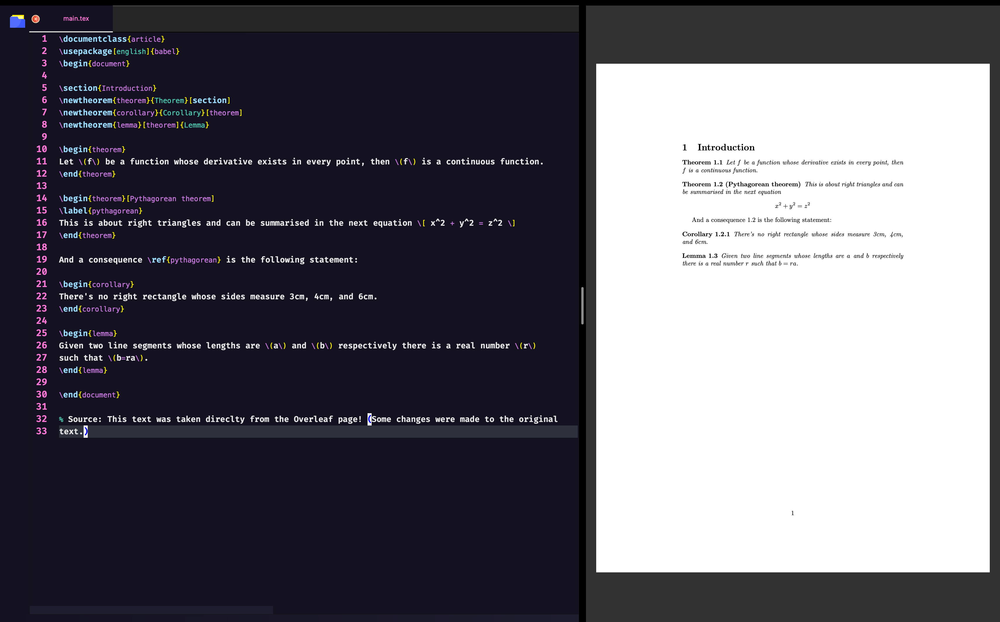

# LiveTeX
Ever get annoyed by the screen flicker whenever you compile LaTeX in Overleaf? LiveTex eliminates this issue by providing a seamless real-time preview experience.

## Features
* **Live Preview**
* **Syntax Highlighting**
* **Intelligent Completion Suggestions** 
* **Customizable Interface**

## Installation
* To compile the source code, you need to install the following python dependencies alongside latexmk to compile TeX to PDF.

```bash
mv dependencies/latexmk.pl /usr/local/bin/
```

```bash
pip install -r dependencies/requirements.txt
```

## Screenshots and Small Demo



#### Future ToDos:
* Explore temporary compilation in HTML via KaTeX rather than PDF, for (possibly?) a more responsive user experience.
* Built-in PDF viewer to not rely on Preview
* Integrate Git (using GitPython)
